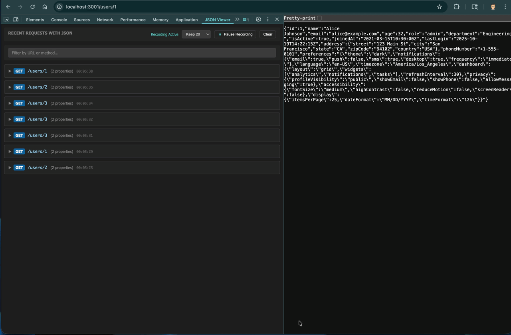

# JSON Viewer Chrome Extension

A Chrome DevTools extension that helps you view and copy escaped JSON strings from network responses with proper formatting.

## Demo



## Features

- **Automatic Network Monitoring**: Automatically monitors all JSON network requests
- **Full Response Viewing**: View and format any JSON response with syntax highlighting
- **Escaped JSON Detection**: Recursively scans JSON responses to find all properties containing escaped JSON (e.g., `"{\"name\":\"value\"}"`)
- **Syntax Highlighting**: Color-coded JSON for better readability (keys, strings, numbers, booleans, null)
- **Quick Actions**: For each JSON property:
  - **Format/Collapse**: Toggle between compact and formatted views with syntax highlighting
  - **Copy**: Copies the JSON to your clipboard (formatted or unformatted based on current view)
- **Property Paths**: Shows the full path to each property for easy identification
- **Search/Filter**: Filter requests by URL or HTTP method in real-time
- **Request History**: Keep track of the last 10-100 JSON requests (configurable)
- **Recording Controls**: Pause/resume recording to freeze the current state
- **Keyboard Navigation**: Full keyboard support for accessibility
- **Accessibility**: ARIA labels, screen reader support, and keyboard shortcuts
- **Multilingual Support**: Built-in internationalization system (currently English)

## Installation

1. Create icon files (required):

   **Easiest method**: Open `generate-icons.html` in your browser, click "Generate Icons", then download each PNG file (icon16.png, icon48.png, icon128.png) and save them in the extension directory.

   **Alternative methods**:
   ```bash
   # Using ImageMagick:
   convert icon.svg -resize 16x16 icon16.png
   convert icon.svg -resize 48x48 icon48.png
   convert icon.svg -resize 128x128 icon128.png
   ```

   Or use an online SVG to PNG converter like:
   - https://cloudconvert.com/svg-to-png
   - https://convertio.co/svg-png/

2. Load the extension in Chrome:
   - Open Chrome and go to `chrome://extensions/`
   - Enable "Developer mode" (toggle in the top right)
   - Click "Load unpacked"
   - Select this directory

3. Open DevTools (F12 or Cmd+Option+I on Mac)
4. You'll see a new "JSON Viewer" tab in DevTools

## Usage

1. Open Chrome DevTools (F12 or Cmd+Option+I)
2. Navigate to the **JSON Viewer** tab
3. Make network requests in your application
4. The extension automatically:
   - Monitors all JSON responses from the Network tab
   - Displays requests in a list with method, URL, and property count
   - Updates in real-time as new requests are made

5. **Controls**:
   - **Search Bar**: Type to filter requests by URL or HTTP method
   - **Recording Controls**: Click pause/resume to freeze/unfreeze the request list
   - **Request Limit**: Choose how many requests to keep in history (10, 20, 50, or 100)
   - **Clear Button**: Remove all requests from the list

6. When a JSON request is detected:
   - Click on any request in the list to view its details (or use keyboard: Tab + Enter/Space)
   - The panel shows the request URL and method
   - Click the request header to expand/collapse request/response headers
   - Lists all JSON properties:
     - **[Full Response]**: The complete JSON response
     - Individual properties with escaped JSON (if any)
   - For each property, you can:
     - Click **Format** to expand and syntax highlight the JSON
     - Click **Collapse** to return to compact view
     - Click **Copy** to copy the JSON to your clipboard (preserves formatting state)

### Keyboard Shortcuts

The extension is fully keyboard accessible:

- **Tab**: Navigate between requests and controls
- **Enter** or **Space**: Expand/collapse selected request
- **Shift+Tab**: Navigate backwards
- **Esc**: Clear search filter (when search input is focused)

All interactive elements support keyboard navigation for accessibility.

## Example

If your API returns something like:
```json
{
  "data": "{\"name\":\"John\",\"age\":30}",
  "status": "success",
  "metadata": {
    "user": "{\"id\":123,\"roles\":[\"admin\"]}"
  }
}
```

The JSON Viewer panel will automatically detect and display:

**Request**: `GET /api/user` (3 properties)

When selected, shows:
- **[Full Response]**: The entire JSON response
  **Actions**: [Format] [Copy]

- **data**: `"{\"name\":\"John\",\"age\":30}"`
  **Actions**: [Format] [Copy]

- **metadata.user**: `"{\"id\":123,\"roles\":[\"admin\"]}"`
  **Actions**: [Format] [Copy]

Clicking **Format** will unescape and syntax highlight the JSON with color coding:
```json
{
  "name": "John",    // keys in light blue, strings in orange
  "age": 30          // numbers in light green
}
```

## Contributing

Contributions are welcome! Please feel free to submit a Pull Request. For major changes, please open an issue first to discuss what you would like to change.

## License

This project is licensed under the MIT License - see the [LICENSE](LICENSE) file for details.

## Development

### File Structure
- `manifest.json`: Extension configuration
- `devtools.html` / `devtools.js`: DevTools integration entry point
- `panel.html` / `panel.js`: Main panel UI and logic
- `i18n.js`: Internationalization system with translation strings
- `icon.svg`: Source icon (needs to be converted to PNG)
- `generate-icons.html`: Utility to generate PNG icons from SVG
- `PRIVACY.md`: Privacy policy for Chrome Web Store submission
- `LICENSE`: MIT License file

### Code Quality Features
- **Accessibility**: Full ARIA support and keyboard navigation
- **Performance**: Incremental rendering for large request lists
- **Modern APIs**: Uses Clipboard API with execCommand fallback
- **Error Handling**: Comprehensive logging for debugging
- **Memory Management**: Configurable request limits to prevent memory bloat
- **Unit Tests**: Comprehensive test suite with Vitest

### Running Tests

This project includes a comprehensive test suite using Vitest.

#### Install Dependencies
```bash
npm install
```

#### Run Tests
```bash
# Run all tests once
npm test

# Run tests in watch mode (re-runs on file changes)
npm run test:watch

# Run tests with coverage report
npm run test:coverage

# Run tests with interactive UI
npm run test:ui
```

#### Test Coverage
The test suite includes:
- **Utility functions**: `escapeHtml`, `truncate`, `syntaxHighlight`, `getDisplayUrl`
- **JSON parsing**: `isEscapedJSON`, `findEscapedJsonProperties`
- **Internationalization**: Translation system with placeholder replacement
- **Timestamp formatting**: Date/time display logic
- **Search/filter**: Bug validation and edge cases

Current coverage goal: 80%+

#### Test Files
- `tests/utils.test.js` - Utility function tests
- `tests/i18n.test.js` - Internationalization tests
- `tests/json-parser.test.js` - JSON parsing logic tests
- `tests/search-filter.test.js` - Search/filter functionality tests (includes bug fix validation)
- `tests/timestamp.test.js` - Timestamp formatting tests

### Adding Translations
To add a new language, edit `i18n.js`:

```javascript
const translations = {
  en: { /* existing English translations */ },
  es: {
    emptyStateTitle: 'Esperando solicitudes de red',
    formatButton: 'Formatear',
    // ... add all translation keys
  }
};
```

Then call `setLanguage('es')` to switch languages.

## Publishing to Chrome Web Store

This extension is ready for publication! Before submitting:

1. ✅ **Privacy Policy**: See [PRIVACY.md](PRIVACY.md) for the privacy policy
2. ✅ **Store Assets**: Create promotional screenshots showing the extension in action
   - At least 1 screenshot (1280x800 or 640x400)
   - Recommended: Small promo tile (440x280)
3. ✅ **Homepage URL**: https://github.com/larsoneric/json-viewer-extension
4. ✅ **Support**: Report issues at https://github.com/larsoneric/json-viewer-extension/issues

## Browser Compatibility

- Chrome 88+ (Manifest V3 support)
- Microsoft Edge 88+ (Chromium-based)
- Other Chromium-based browsers with Manifest V3 support

## Known Limitations

- Only processes responses with `Content-Type: application/json` or `application/javascript`
- Timestamps show date only if not from today
- Maximum request history: 100 requests

## Troubleshooting

**Extension won't load**: Make sure you've created the icon PNG files (icon16.png, icon48.png, icon128.png). Use `generate-icons.html` to create them easily.

**Panel shows "Waiting for Network Requests"**: Make network requests in your application. The extension monitors all JSON responses (Content-Type: application/json or javascript).

**Escaped JSON properties not detected**: The extension looks for string values that can be parsed as valid JSON objects or arrays. Make sure your escaped JSON is properly formatted.

**Syntax highlighting not working**: Make sure you click the "Format" button to expand the JSON. Syntax highlighting only appears in the formatted view.

**Search not working**: The search filters by URL path and HTTP method. Try using partial matches (e.g., "api" or "GET").
